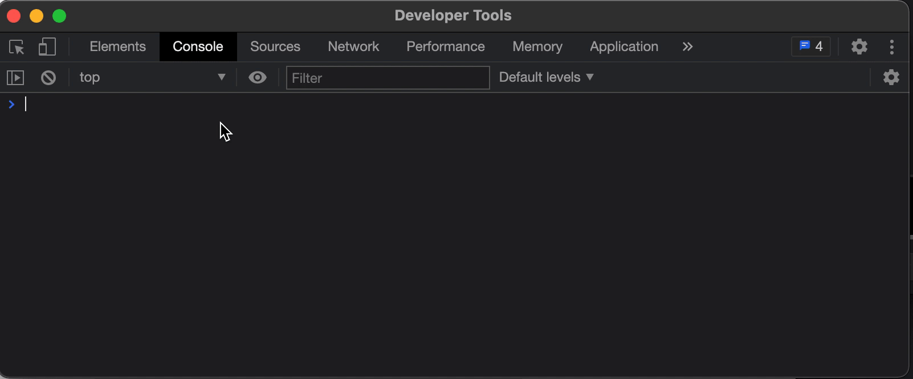

# FigmaConsoleKit

Browser Devtool console is Figma's best scripting tool, FigmaConsoleKit can make it better, add a debugging-friendly API, most commonly used libraries(`axios`,`lodash`,`mathjs`,`Color`,`font-color-contrast`).


## Usege

paste code into figma console

```js
fetch(
  "https://raw.githubusercontent.com/Moonvy/FigmaConsoleKit/master/dist/FigmaConsoleKit.js?v1.1.0"
).then((r) => r.text().then((c) => eval(c)));
```

or

paste [the code](dist/FigmaConsoleKit.js) into console

### Access

- `activeNodes` : currently selected layers (multiple)
- `activeNode` : currently selected layer (only one is fetched)
- `getChildrenByName(node)` : get multiple sublayers by layer name
- `getClidByName(node)` : get a sublayer by layer name



### Print

- `show(node)` : Show layer information
- `json(node)` : converts the layer information into a JSON string

### Color

- `toFloatColor(intColor)` : [255,255,255] => {r:1.0, g:1.0, b:1.0}
- `toIntColor(floatColor)` : {r:1.0, g:1.0, b:1.0} => [255,255,255]

### Text

- `loadNodeFonts(node)` - prepare the font used for a layer
- `setNodeText(node, text)` - set the text content of the text layer

### Tidy

- `tidyX(nodes, cols, gap)` : rearrange layers by number of columns

### Utils

- [`axios`](https://github.com/axios/axios): best JavaScript HTTP client.
- [`font-color-contrast`](https://github.com/russoedu/font-color-contrast#readme): use black or white font according to the given background color.
- [`lodash`](https://github.com/lodash/lodash): a modern JavaScript utility library delivering modularity, performance & extras.
- [`mathjs`](https://mathjs.org/): an extensive math library.
- [`Color`](https://github.com/Qix-/color#readme): immutable color conversion and manipulation with support for CSS color strings.
