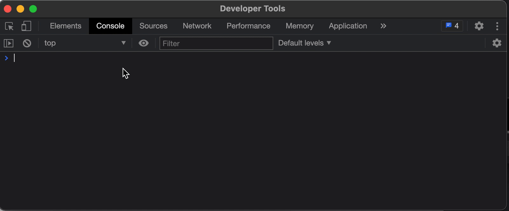

# FigmaConsoleKit 

In Figma's browser console, Add a debugging-friendly API

## Usege

paste [the code](dist/FigmaConsoleKit.js) into console

### Access
 - `activeNodes` : currently selected layers (multiple)
 - `activeNode` : currently selected layer (only one is fetched)

### Print

- `show(node)` : Show layer information
- `json(node)` converts the layer information into a JSON string